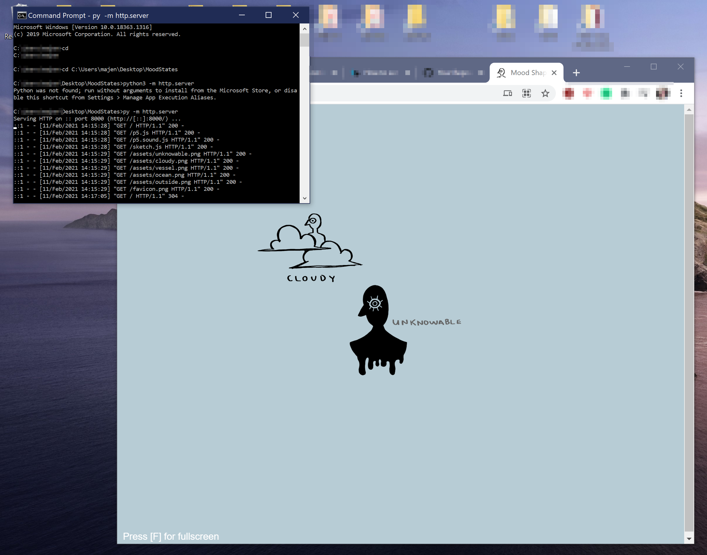

## How to set up localhost on Windows with Python 3x

### To get to your project directory:
1. Type in:

        cd 

    Note: **Don't forget the space** after cd.

2. Drag your directory (the folder of your project) on top of the Command Prompt application window. It will change your directory into your project directory, giving you the full directory path.
- Press [Enter].

### To start localhost in Python 3x:
1. Type in:

        py -m http.server

    Or, depending on the installation:

        python3 -m http.server

2. Press [Enter].

#### Example of what the Command Prompt should look like

Image Source: https://www.technobush.com/set-up-local-web-server-in-python/

3. Open your browser of choice.
	Type in:

		localhost:8000

#### Example of what the successful setup should look like
